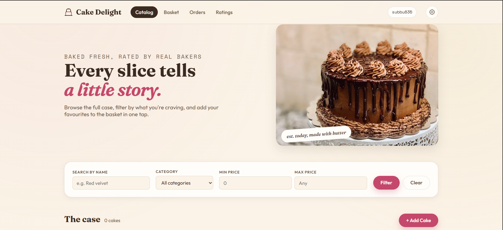
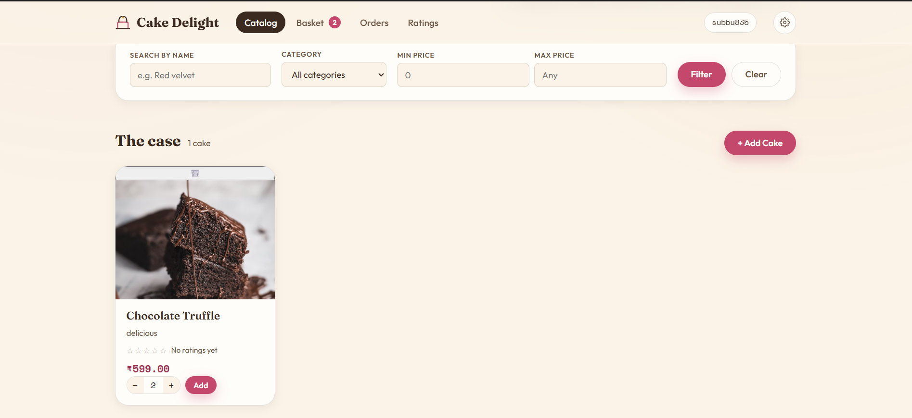
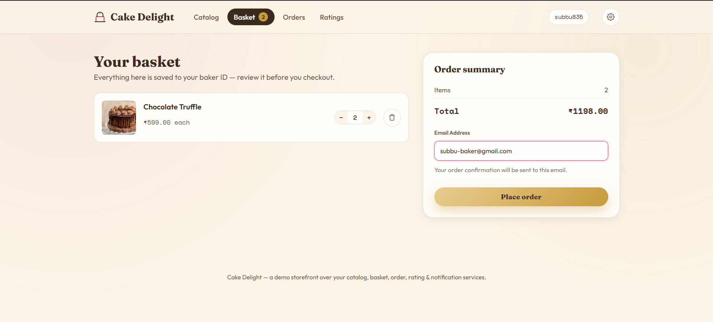
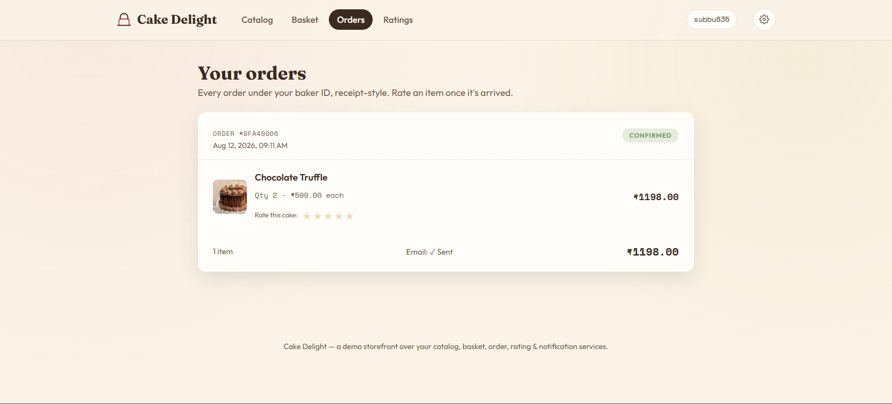
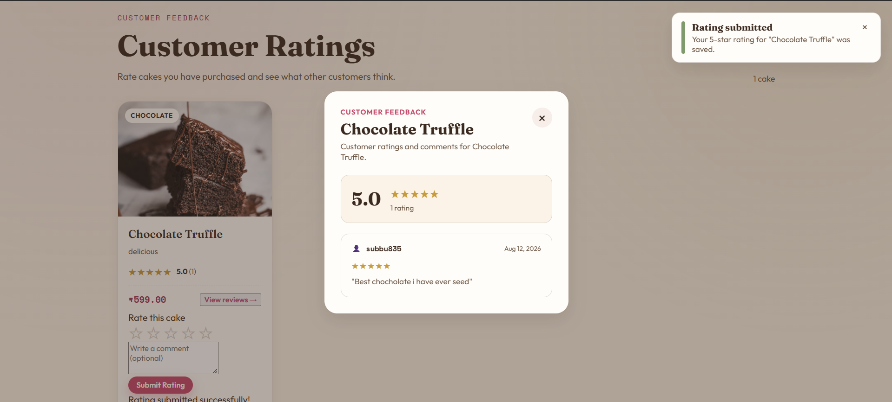
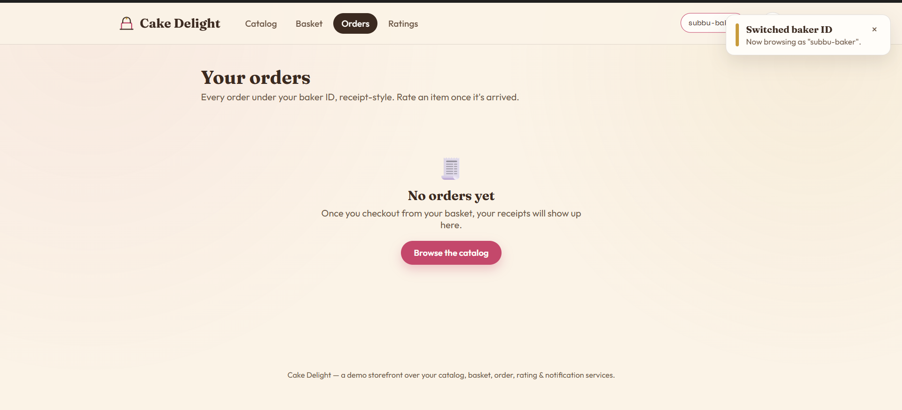

# 🎂 CakeDelight

A microservices-based e-commerce platform for ordering cakes online, built with **Node.js/Express, MongoDB, RabbitMQ, and an API Gateway**.

The application can be run using **Docker Compose** or deployed using **Kubernetes**.

---

## 📖 Table of Contents

- [Project Introduction](#-project-introduction)
- [Architecture](#-architecture)
- [Repository Layout](#-repository-layout)
- [API Gateway Routing](#-api-gateway-routing)
- [Per-Service Endpoints](#-per-service-endpoints)
- [Getting Started](#-getting-started)
- [Kubernetes Deployment](#️-kubernetes-deployment)
- [Minikube Deployment](#-minikube-deployment)
- [RabbitMQ](#-rabbitmq)
- [Notification Service](#-notification-service)
- [Reliability & Observability](#-reliability--observability)
- [Basic Application Flow](#-basic-application-flow)
- [How to Test the Application](#how-to-test-the-application)

---

## 🍰 Project Introduction

CakeDelight is a cloud-native application built using independent microservices.

Each service manages its own data and communicates with other services using **HTTP** or **RabbitMQ** where required.

| Component | Responsibility |
| --- | --- |
| **api-gateway** | Single entry point for client requests |
| **catalog-service** | Manages cakes and catalog data |
| **order-service** | Manages baskets and orders |
| **rating-service** | Manages ratings |
| **notification-service** | Handles notifications using RabbitMQ and email |
| **frontend** | Static HTML/CSS/JavaScript client |

---

## 🏗 Architecture

```text
                         ┌──────────────┐
                         │   Frontend   │
                         │ HTML/CSS/JS  │
                         └──────┬───────┘
                                │
                                ▼
                       ┌─────────────────┐
                       │   API Gateway   │
                       │     :8080       │
                       └────────┬────────┘
                                │
          ┌─────────────────────┼─────────────────────┐
          │                     │                     │
          ▼                     ▼                     ▼
 ┌────────────────┐    ┌────────────────┐    ┌────────────────┐
 │ Catalog Service │    │ Order Service  │    │ Rating Service │
 │     :4001       │    │     :4002      │    │     :4003      │
 └───────┬────────┘    └───────┬────────┘    └───────┬────────┘
         │                      │                     │
         ▼                      ▼                     ▼
 ┌──────────────┐       ┌──────────────┐      ┌──────────────┐
 │ Catalog Mongo │       │  Order Mongo │      │ Rating Mongo │
 └──────────────┘       └──────────────┘      └──────────────┘
                                │
                                │ order.completed
                                ▼
                         ┌─────────────┐
                         │  RabbitMQ   │
                         │  :5672      │
                         └──────┬──────┘
                                │
                                ▼
                       ┌───────────────────┐
                       │ Notification      │
                       │ Service :4004     │
                       └─────────┬─────────┘
                                 │
                   ┌─────────────┴─────────────┐
                   │                           │
                   ▼                           ▼
          ┌────────────────┐          ┌────────────────┐
          │ Notification   │          │ Email Service  │
          │ MongoDB        │          │ Credentials    │
          └────────────────┘          └────────────────┘
```

### Service Communication

- **Frontend → API Gateway**: Client requests are sent through the API Gateway.
- **API Gateway → Backend Services**: Routes requests to the appropriate service.
- **Order Service → Catalog Service**: Communicates using HTTP.
- **Rating Service → Order Service**: Communicates using HTTP.
- **Order Service → RabbitMQ**: Publishes `order.completed` events.
- **Notification Service → RabbitMQ**: Consumes order events.
- **Notification Service → MongoDB**: Stores notification data.
- **Notification Service → Email**: Sends email notifications using configured credentials.
- Each service has its own MongoDB database.

---

## 📂 Repository Layout

```text
CAKEDELIGHT/
│
├── api-gateway/
├── catalog-service/
├── order-service/
├── rating-service/
├── notification-service/
│
├── frontend/
│   ├── css/
│   ├── js/
│   └── index.html
│
├── k8s/
│   ├── namespace.yaml
│   ├── api-gateway/
│   ├── catalog/
│   ├── order/
│   ├── rating/
│   ├── notification/
│   │   ├── deployment.yaml
│   │   ├── notification-secret.yaml
│   │   └── service.yaml
│   └── infrastructure/
│       ├── catalog-mongo/
│       ├── order-mongo/
│       ├── notification-mongo/
│       ├── rating-mongo/
│       └── rabbitmq/
│
├── k8s-hub/
│   ├── namespace.yaml
│   ├── api-gateway/
│   ├── catalog/
│   ├── order/
│   ├── rating/
│   ├── notification/
│   └── infrastructure/
│
├── .env
├── docker-compose.yaml
├── docker-compose.hub.yaml
└── README.md
```

---

## 🌐 API Gateway Routing

The API Gateway provides a single entry point for the application.

**Gateway Port:**

```text
8080
```

| Route | Service |
| --- | --- |
| `/api/catalog/*` | Catalog Service |
| `/api/basket/*` | Order Service |
| `/api/orders/*` | Order Service |
| `/api/ratings/*` | Rating Service |
| `/api/notifications/*` | Notification Service |

Example:

```text
http://localhost:8080/api/catalog/cakes/all
```

---

## 🔌 Per-Service Endpoints

### Catalog Service

**Port:** `4001`

| Method | Endpoint | Description |
| --- | --- | --- |
| GET | `/health` | Health check |
| GET | `/api/catalog/cakes/` | Get cakes |
| GET | `/api/catalog/cakes/all` | Get all cakes |
| GET | `/api/catalog/cakes/:id` | Get cake by ID |
| POST | `/api/catalog/cakes/` | Create a cake |
| PUT | `/api/catalog/cakes/:id` | Update a cake |
| DELETE | `/api/catalog/cakes/:id` | Delete a cake |

### Order Service — Basket

**Port:** `4002`

| Method | Endpoint | Description |
| --- | --- | --- |
| GET | `/api/basket/:userId` | Get user's basket |
| POST | `/api/basket/:userId/items` | Add item to basket |
| PUT | `/api/basket/:userId/items/:cakeId` | Update item quantity |
| DELETE | `/api/basket/:userId/items/:cakeId` | Remove item from basket |

### Order Service — Orders

**Port:** `4002`

| Method | Endpoint | Description |
| --- | --- | --- |
| POST | `/api/orders/checkout` | Checkout and create order |
| GET | `/api/orders/detail/:orderId` | Get order by ID |
| GET | `/api/orders/:userId` | Get orders for a user |
| GET | `/api/orders/check-purchase/:userId/:cakeId` | Check whether user purchased a cake |

### Rating Service

**Port:** `4003`

| Method | Endpoint | Description |
| --- | --- | --- |
| POST | `/api/ratings/submit` | Submit a rating |
| GET | `/api/ratings/` | Get ratings |
| GET | `/api/ratings/:cakeId/average` | Get average rating for a cake |
| GET | `/api/ratings/:cakeId` | Get ratings for a cake |

### Notification Service

**Port:** `4004`

| Method | Endpoint | Description |
| --- | --- | --- |
| GET | `/health` | Health check |
| GET | `/api/notifications/:userId` | Get notifications for a user |

---

## 🚀 Getting Started

The project supports two Docker Compose modes.

| Configuration | Purpose |
| --- | --- |
| `docker-compose.yaml` | Builds service images locally from source code |
| `docker-compose.hub.yaml` | Uses published Docker Hub images |

### Prerequisites

- Docker Desktop
- Docker Compose

### 🐳 Docker Compose — Local Build

```bash
docker compose -f docker-compose.yaml up -d --build
```

Check the containers:

```bash
docker compose -f docker-compose.yaml ps
```

Access:

```text
http://localhost:8080
```

Stop:

```bash
docker compose -f docker-compose.yaml down
```

### ☁️ Docker Compose — Docker Hub Images

```bash
docker compose -f docker-compose.hub.yaml up -d
```

Check the containers:

```bash
docker compose -f docker-compose.hub.yaml ps
```

Access:

```text
http://localhost:8080
```

Stop:

```bash
docker compose -f docker-compose.hub.yaml down
```

---

## ☸️ Kubernetes Deployment

The project provides two Kubernetes configurations:

| Configuration | Purpose |
| --- | --- |
| `k8s/` | Kubernetes deployment using the local/source-built images |
| `k8s-hub/` | Kubernetes deployment using Docker Hub images |

### Prerequisites

- Docker Desktop
- Kubernetes enabled in Docker Desktop
- `kubectl`

### ☸️ Kubernetes — Normal Deployment

Use `k8s/`.

Create the namespace:

```bash
kubectl apply -f k8s/namespace.yaml
```

Deploy infrastructure:

```bash
kubectl apply -f k8s/infrastructure/catalog-mongo/
kubectl apply -f k8s/infrastructure/order-mongo/
kubectl apply -f k8s/infrastructure/notification-mongo/
kubectl apply -f k8s/infrastructure/rating-mongo/
kubectl apply -f k8s/infrastructure/rabbitmq/
```

Deploy the notification secret:

```bash
kubectl apply -f k8s/notification/notification-secret.yaml
```

Deploy the services:

```bash
kubectl apply -f k8s/catalog/
kubectl apply -f k8s/order/
kubectl apply -f k8s/rating/
kubectl apply -f k8s/notification/
```

Deploy the API Gateway:

```bash
kubectl apply -f k8s/api-gateway/
```

Check:

```bash
kubectl get pods -n cake-delight
kubectl get svc -n cake-delight
```

Forward the API Gateway to port `8080`:

```bash
kubectl port-forward service/api-gateway 8080:8080 -n cake-delight
```

Access:

```text
http://localhost:8080
```

### ☁️ Kubernetes — Docker Hub Images

Use `k8s-hub/`.

Create the namespace:

```bash
kubectl apply -f k8s-hub/namespace.yaml
```

Deploy infrastructure:

```bash
kubectl apply -f k8s-hub/infrastructure/catalog-mongo/
kubectl apply -f k8s-hub/infrastructure/order-mongo/
kubectl apply -f k8s-hub/infrastructure/notification-mongo/
kubectl apply -f k8s-hub/infrastructure/rating-mongo/
kubectl apply -f k8s-hub/infrastructure/rabbitmq/
```

Deploy the notification secret:

```bash
kubectl apply -f k8s-hub/notification/notification-secret.yaml
```

Deploy the services:

```bash
kubectl apply -f k8s-hub/catalog/
kubectl apply -f k8s-hub/order/
kubectl apply -f k8s-hub/rating/
kubectl apply -f k8s-hub/notification/
```

Deploy the API Gateway:

```bash
kubectl apply -f k8s-hub/api-gateway/
```

Check:

```bash
kubectl get pods -n cake-delight
kubectl get svc -n cake-delight
```

Forward the API Gateway to port `8080`:

```bash
kubectl port-forward service/api-gateway 8080:8080 -n cake-delight
```

Access:

```text
http://localhost:8080
```

---

## 🚀 Minikube Deployment

Minikube can be used to run CakeDelight locally on Kubernetes.

### Prerequisites

- Docker Desktop
- Minikube
- `kubectl`

### 1. Start Minikube

```bash
minikube start
```

Check:

```bash
minikube status
kubectl get nodes
```

### 2. Deploy Docker Hub Images

Use `k8s-hub/`:

```bash
kubectl apply -f k8s-hub/namespace.yaml

kubectl apply -f k8s-hub/infrastructure/catalog-mongo/
kubectl apply -f k8s-hub/infrastructure/order-mongo/
kubectl apply -f k8s-hub/infrastructure/notification-mongo/
kubectl apply -f k8s-hub/infrastructure/rating-mongo/
kubectl apply -f k8s-hub/infrastructure/rabbitmq/

kubectl apply -f k8s-hub/notification/notification-secret.yaml

kubectl apply -f k8s-hub/catalog/
kubectl apply -f k8s-hub/order/
kubectl apply -f k8s-hub/rating/
kubectl apply -f k8s-hub/notification/

kubectl apply -f k8s-hub/api-gateway/
```

### 3. Check the Deployment

```bash
kubectl get pods -n cake-delight
kubectl get svc -n cake-delight
```

### 4. Forward API Gateway to Port 8080

```bash
kubectl port-forward service/api-gateway 8080:8080 -n cake-delight
```

Keep this terminal open while testing.

Access:

```text
http://localhost:8080
```

---

## 📨 RabbitMQ

RabbitMQ is used for asynchronous communication between the Order Service and Notification Service.

```text
Order Service
      │
      │ order.completed
      ▼
   RabbitMQ
      │
      ▼
Notification Service
      │
      ├── Store notification
      └── Send email
```

RabbitMQ ports:

```text
5672   → AMQP
15672  → Management UI
```

---

## 🔔 Notification Service

The Notification Service:

- Consumes `order.completed` events from RabbitMQ.
- Stores notifications in MongoDB.
- Sends email notifications.

Configuration:

```text
Port: 4004
Database: notification_db
RabbitMQ: rabbitmq
```

Email credentials:

```text
EMAIL_USER
EMAIL_PASS
```

Kubernetes secrets:

```text
k8s/notification/notification-secret.yaml
k8s-hub/notification/notification-secret.yaml
```

---

## 🩺 Reliability & Observability

The project includes:

- Independent microservices
- Separate MongoDB database for each service
- Docker containerization
- Docker Compose orchestration
- Kubernetes Deployments and Services
- RabbitMQ for asynchronous communication
- API Gateway for centralized routing
- Persistent storage for MongoDB
- Kubernetes namespaces
- PersistentVolumeClaims

---

## 🧪 Basic Application Flow

```text
Frontend
   ↓
API Gateway
   ↓
Catalog / Order / Rating Services
   ↓
MongoDB

Order Completed
   ↓
RabbitMQ
   ↓
Notification Service
   ↓
Notification MongoDB
   ↓
Email
```

---

## How to Test the Application

The project includes a frontend inside the `client/` folder.

### 1. Start the Backend

Start the backend using one of the options below.

For Docker Hub:

```bash
docker compose -f docker-compose.hub.yaml up -d
```

For Minikube:

```bash
minikube start
```

Then deploy `k8s-hub/` and run:

```bash
kubectl port-forward service/api-gateway 8080:8080 -n cake-delight
```

### 2. Open the Frontend

Open the project in **Visual Studio Code**.

Go to:

```text
client/index.html
```

Right-click `index.html` and select **Open with Live Server**.

The frontend will open in the browser, for example:

```text
http://127.0.0.1:5500/client/index.html
```

### 3. Test the Application

Use the frontend UI to test:

- Browse cakes
- View cake details
- Add cakes to the basket
- Update basket quantities
- Checkout orders
- View orders
- Submit ratings
- View ratings
- Verify order completion and email notification status

The frontend communicates with the API Gateway at:

```text
http://localhost:8080
```

### 4. Screenshots

Screenshots of the application can be added below to help with testing and evaluation.

Example:













> **Note:** Start the backend first and make sure the API Gateway is available on port `8080` before opening the frontend with Live Server.
